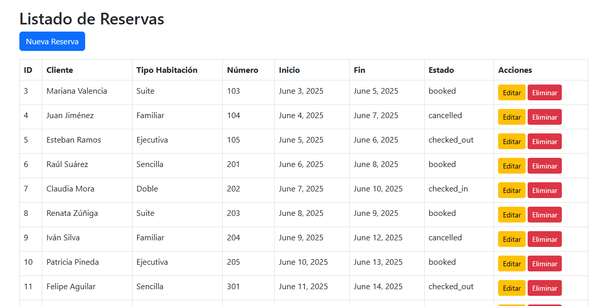
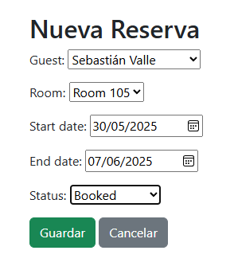
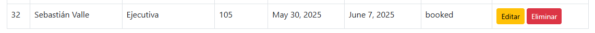
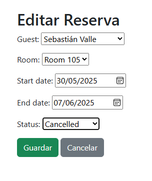
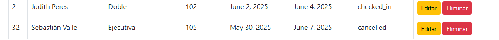
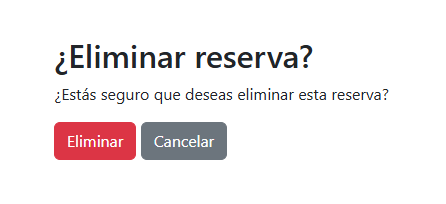

# LAB3-DB-ORM 🏨

Este proyecto es parte del **Laboratorio 3 de la clase de Bases de Datos 1**, y consiste en el desarrollo de una aplicación CRUD usando Django y su ORM, para la gestión de reservas en un hotel. La aplicación incluye relaciones entre huéspedes, habitaciones, tipos de habitaciones, servicios, reservas y pagos.

El sistema también integra una vista SQL (`VIEW`) para facilitar la visualización consolidada de datos de varias tablas, cumpliendo con los requerimientos del laboratorio.

---

## 🧠 Funcionalidades principales

- CRUD completo para **reservas**
- Formulario interactivo con validaciones (fechas válidas, selección de huéspedes, etc.)
- Vista consolidada (`vista_reservas_completas`) para mostrar información relacionada
- Frontend sencillo basado en templates de Django + Bootstrap
- API REST disponible para todas las entidades 

---

## ⚙️ Requisitos

- Python 3.10+
- pip
- Git

---

## 🚀 Instrucciones de instalación

1. **Clonar el repositorio**

```bash
git clone https://github.com/usuario/LAB3-DB-ORM.git
cd LAB3-DB-ORM
```

2. **Crear y activar un entorno virtual**

```bash
python -m venv venv
# Windows
venv\Scripts\activate
# Linux/macOS
source venv/bin/activate
```

3. **Instalar dependencias**

```bash
pip install -r requirements.txt
```

4. **Crear archivo de entorno**

```bash
cp .env.example .env
```

5. **Crear y configurar la base de datos**

Asegúrate de haber definido en tu archivo `.env` el nombre de la base de datos. Luego crea la base de datos manualmente desde tu gestor de base de datos favorito, utilizando el nombre que definiste en el `.env`.

Después, ejecuta las migraciones para que Django cree la estructura base del proyecto:

```bash
python manage.py migrate
```

6. **Insertar datos de prueba**

Una vez creada la base de datos y aplicadas las migraciones, abre tu gestor de base de datos y ejecuta el contenido de los siguientes archivos:

- `data.sql` → para insertar registros de prueba.
- `view.sql` → para crear la vista `vista_reservas_completas`.


7. **Levantar el servidor**

```bash
python manage.py runserver
```

---

## 🌐 Interfaz

- CRUD Web: http://localhost:8000/
- Documentación API: http://localhost:8000/docs/

---

## 📸 Pruebas de funcionalidad

A continuación se muestran capturas de pantalla que evidencian el funcionamiento del sistema:


### 🧾 Listado de Reservas


---

### ➕ Crear Reserva
  


---

### ✏️ Editar Reserva
  


---

### ❌ Eliminar Reserva
  


---

## 📌 Notas adicionales

- Se utilizaron **tipos de datos personalizados** como `DecimalField` para valores monetarios y `CharField` con `choices` para campos con valores restringidos.
- El CRUD se implementa tanto con **Django clásico (HTML + ORM)** como con **API REST (DRF)**.

---

## 🧑‍💻 Autor

- Nombres: Diego Rosales y Fabián Morales
- Universidad del Valle de Guatemala
- Curso: cc3088 - Bases de Datos 1

